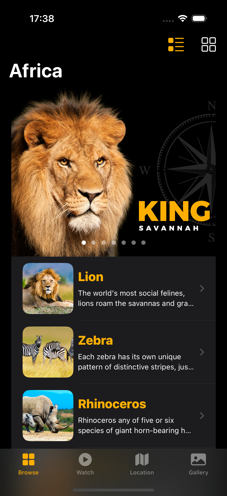
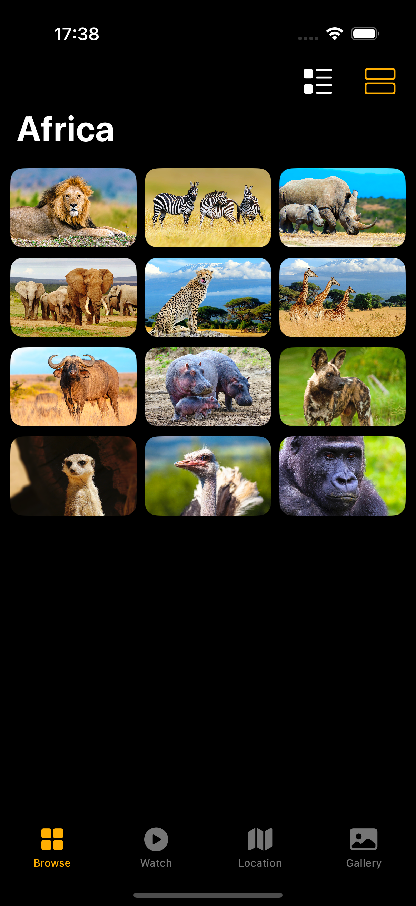
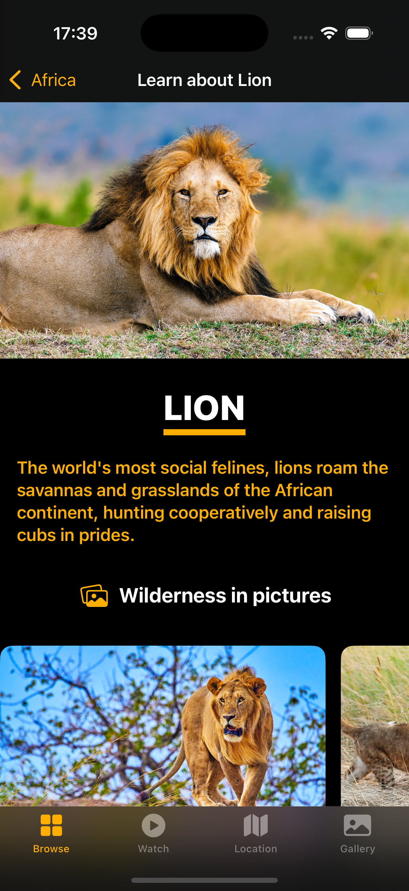
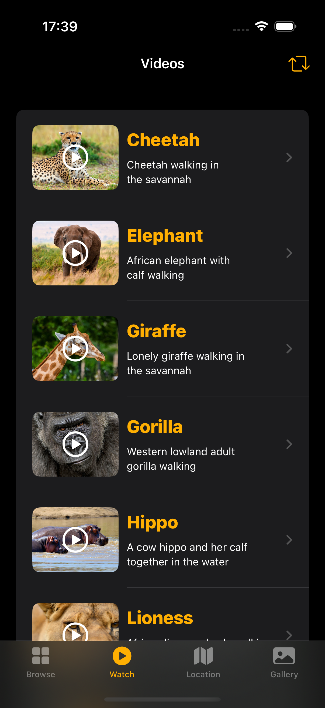
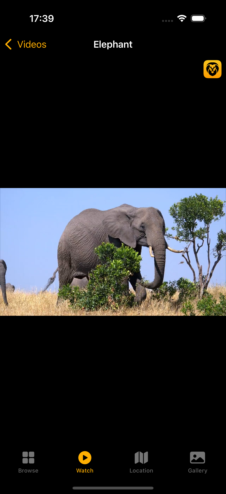
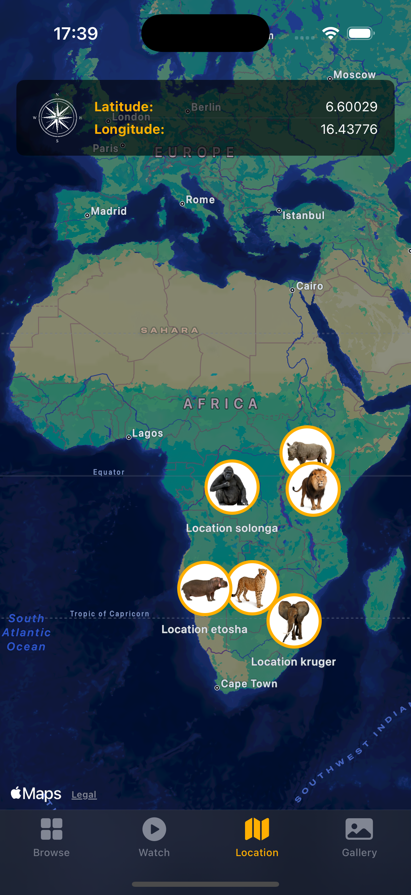
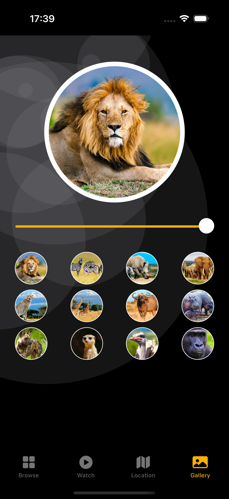

# Africa - SwiftUI Educational App

<p align="center">
  
  
  
</p>

## Overview

**Africa** is a comprehensive iOS application built with SwiftUI that provides an immersive educational experience about African wildlife. The app features detailed information about various African animals, interactive maps showing their natural habitats, educational videos, and a stunning image gallery.

## Features

### Browse Animals
- Comprehensive list of African animals with detailed information
- Beautiful card-based UI with animal images
- Grid and list view options
- Detailed animal profiles including:
  - Scientific descriptions
  - Natural habitat information
  - Interesting facts
  - Image galleries
  - External Wikipedia links

### Watch Videos
- Curated collection of educational videos about African wildlife
- Integrated video player
- Video list with thumbnails and descriptions
- Seamless playback experience

### Interactive Map
- Geographic locations of African animals
- Custom map annotations
- Explore where different species live in their natural habitats
- Interactive map interface with pinch-to-zoom

### Gallery
- High-quality images of African wildlife
- Grid-based photo gallery
- Beautiful image presentations
- Smooth scrolling experience

### iMessage Stickers
- Custom sticker pack featuring African animals
- Stickers include: Lion, Elephant, Giraffe, Zebra, Cheetah, and Gorilla
- Share your favorite animals in Messages

## Technologies & Frameworks

- **SwiftUI** - Modern declarative UI framework
- **MapKit** - Interactive map functionality
- **AVKit** - Video playback capabilities
- **Codable** - JSON data parsing
- **Bundle Extensions** - Efficient data loading
- **MVVM Architecture** - Clean code organization

## Project Structure

```
SwiftUIProject7-Africa/
├── App/
│   ├── SwiftUIProject7_AfricaApp.swift    # Main app entry point
│   ├── MainView.swift                      # TabView container
│   ├── ContentView.swift                   # Animal browse view
│   ├── VideoListView.swift                 # Video library
│   ├── MapView.swift                       # Interactive map
│   └── GalleryView.swift                   # Photo gallery
├── View/
│   ├── AnimalDetailView.swift             # Detailed animal information
│   ├── AnimalListItemView.swift           # List item component
│   ├── AnimalGridItemView.swift           # Grid item component
│   ├── VideoPlayerView.swift              # Video player component
│   ├── VideoListItemView.swift            # Video list item
│   ├── MapAnnotationView.swift            # Map markers
│   ├── InsetMapView.swift                 # Embedded map view
│   ├── InsetGalleryView.swift             # Embedded gallery
│   ├── InsetFactView.swift                # Animal facts display
│   ├── CoverImageView.swift               # Cover images
│   ├── HeadingView.swift                  # Section headings
│   ├── ExternalWeblinkView.swift          # Web links
│   ├── MotionAnimationView.swift          # Animations
│   └── CreditsView.swift                  # App credits
├── Model/
│   ├── AnimalModel.swift                  # Animal data structure
│   ├── VideoModel.swift                   # Video data structure
│   ├── LocationModel.swift                # Location data structure
│   └── CoverImageModel.swift              # Cover image structure
├── Data/
│   ├── animals.json                       # Animal data
│   ├── videos.json                        # Video data
│   ├── locations.json                     # Location data
│   └── covers.json                        # Cover image data
├── Extension/
│   └── CodableBundleExtension.swift      # Bundle decode helper
├── Helper/
│   └── VideoPlayerHelper.swift           # Video playback helper
├── Modifier/
│   └── CenterModifier.swift              # Custom view modifier
└── Assets.xcassets/                       # Images and resources
```

## Data Models

### Animal Model
```swift
struct Animal: Codable, Identifiable {
    let id: String
    let name: String
    let headline: String
    let description: String
    let link: String
    let image: String
    let gallery: [String]
    let fact: [String]
}
```

### Video Model
```swift
struct Video: Codable, Identifiable {
    let id: String
    let name: String
    let headline: String
}
```

### Location Model
```swift
struct Location: Codable, Identifiable {
    let id: String
    let name: String
    let image: String
    let latitude: Double
    let longitude: Double
}
```

## Requirements

- iOS 15.0+
- Xcode 13.0+
- Swift 5.5+
- macOS 11.0+ (for development)

## Installation

1. Clone the repository:
```bash
git clone https://github.com/alassanepaulyaro/SwiftUIProject7-Africa.git
```

2. Navigate to the project directory:
```bash
cd SwiftUIProject7-Africa
```

3. Open the project in Xcode:
```bash
open SwiftUIProject7-Africa.xcodeproj
```

4. Select your target device or simulator

5. Build and run the project (⌘ + R)

## Usage

### Running the App
1. Launch the app to see the main tab interface
2. Browse through different tabs:
   - **Browse**: Explore the animal list, tap any animal for detailed information
   - **Watch**: View educational videos about African wildlife
   - **Location**: See where animals live on an interactive map
   - **Gallery**: Browse through beautiful wildlife photography

### Exploring Animals
- Tap on any animal card to view detailed information
- Scroll through the animal's image gallery
- Read interesting facts about each species
- Tap the external link to learn more on Wikipedia

### Watching Videos
- Select any video from the list
- Tap to play and watch educational content
- Videos cover various aspects of African wildlife

### Using the Map
- Zoom and pan to explore different regions
- Tap on map annotations to see which animals live there
- Discover the geographic distribution of African wildlife

## Featured Animals

The app includes comprehensive information about:
- Lion
- Zebra
- Rhinoceros
- Elephant
- Giraffe
- Cheetah
- Hippopotamus
- Buffalo
- Gorilla
- Ostrich
- And more...

## Key Features Implementation

### Custom Bundle Extension
The app uses a custom `Bundle` extension to efficiently decode JSON data:
```swift
extension Bundle {
    func decode<T: Codable>(_ type: T.Type, from file: String) -> T
}
```

### SwiftUI Modifiers
Custom view modifiers for consistent styling:
- `CenterModifier` - Centers content within views

### Video Player Helper
Dedicated helper class for managing video playback functionality

## Screenshots

<p align="center">
  
  
  
</p>

<p align="center">
  
  
  
</p>

<p align="center">
  
  
  
</p>

## Learning Objectives

This project demonstrates:
- SwiftUI app architecture and navigation
- TabView implementation
- Complex list and grid layouts
- Custom view components and modifiers
- JSON data parsing with Codable
- Bundle resource management
- MapKit integration
- Video playback with AVKit
- Image gallery implementation
- iMessage sticker pack creation
- MVVM design pattern
- Reusable component design

## Contributing

Contributions are welcome! If you'd like to improve the app:

1. Fork the repository
2. Create a feature branch (`git checkout -b feature/AmazingFeature`)
3. Commit your changes (`git commit -m 'Add some AmazingFeature'`)
4. Push to the branch (`git push origin feature/AmazingFeature`)
5. Open a Pull Request

## Future Enhancements

Potential features for future versions:
- [ ] Add more animals and species
- [ ] Implement search functionality
- [ ] Add favorites/bookmarking system
- [ ] Include animal sounds
- [ ] Add augmented reality (AR) features
- [ ] Implement quiz/game mode
- [ ] Add multi-language support
- [ ] Include conservation status information
- [ ] Social sharing features
- [ ] Offline mode support

## Author

Created by **Yaro Paul** - December 2024

## Acknowledgments

- Animal information sourced from Wikipedia
- Images and videos are for educational purposes
- Built as part of SwiftUI learning journey
- Inspired by African wildlife conservation efforts

## License

This project is available for educational purposes. Please ensure proper attribution when using or modifying the code.

---

**Note**: This is an educational project created to learn SwiftUI and iOS development. All content is used for educational purposes only.

## Support

If you find this project helpful, please consider:
- Giving it a star on GitHub
- Sharing it with others learning SwiftUI
- Contributing improvements
- Reporting bugs or suggesting features

## Resources

- [SwiftUI Documentation](https://developer.apple.com/documentation/swiftui/)
- [MapKit Documentation](https://developer.apple.com/documentation/mapkit/)
- [AVKit Documentation](https://developer.apple.com/documentation/avkit/)
- [African Wildlife Conservation](https://www.awf.org/)

---

Made with ❤️ and SwiftUI
